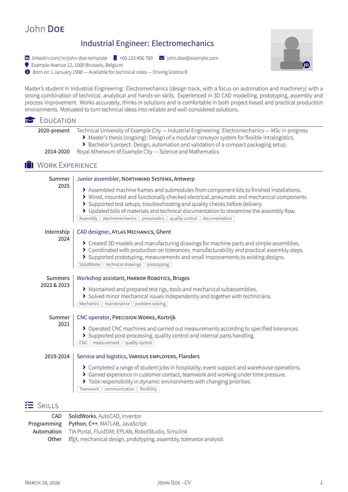
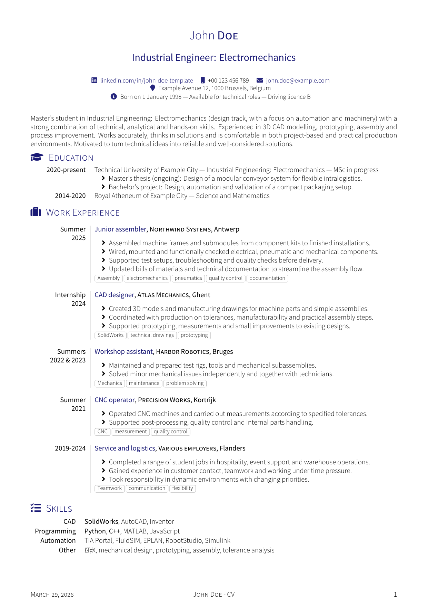
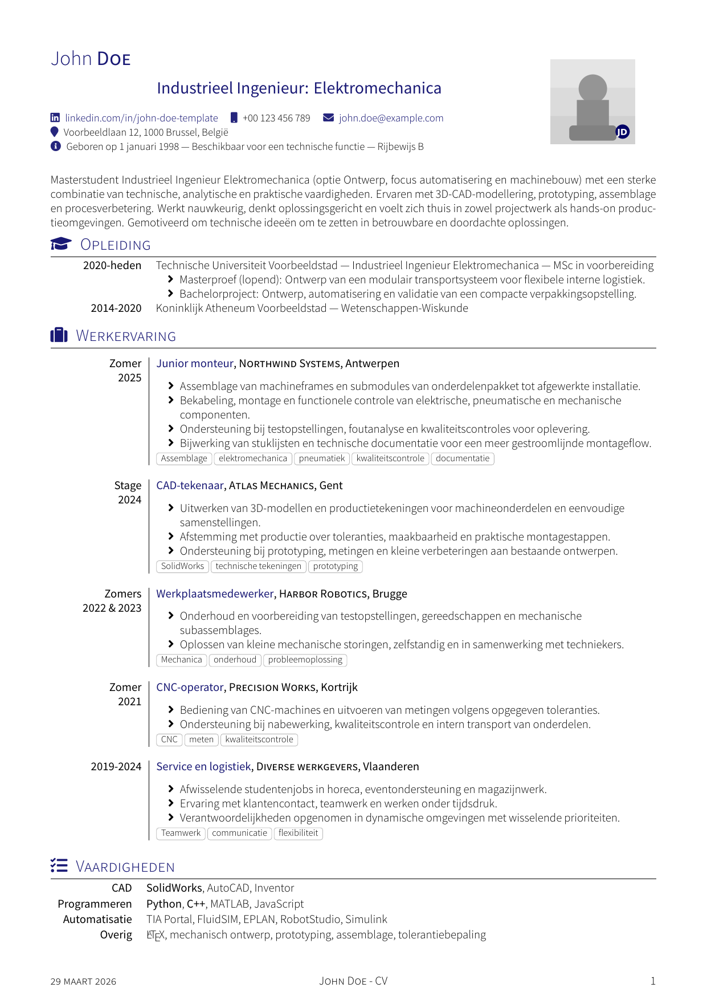
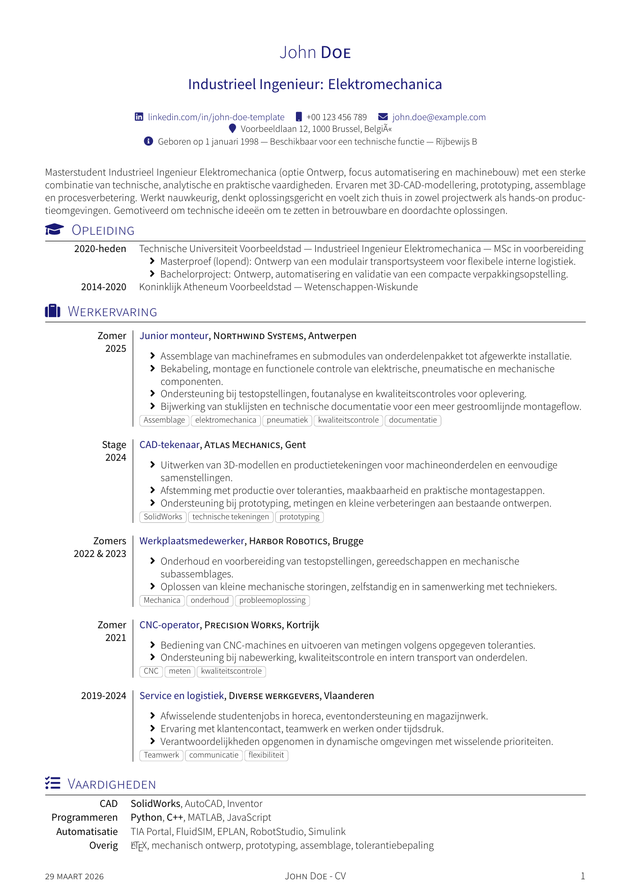

# Open CV Template for LaTeX

A two-language CV template repository for LaTeX users, with one Dutch version and one English version in the same project.

This repository is a clean rewrite of an older public CV setup that had become difficult to run and maintain on modern LaTeX installations. The visual style of the original layout was intentionally preserved, while the content, structure and packaging were reworked into a reusable template.

If you recognise the original public source or inspiration behind the older version of this layout, please open an issue or discussion on GitHub. A proper attribution note will gladly be added.

## Preview

| | With photo | Without photo |
|---|---|---|
| **English** | [](previews/cv-template-preview-en-with-photo.pdf) | [](previews/cv-template-preview-en-no-photo.pdf) |
| **Dutch** | [](previews/cv-template-preview-nl-with-photo.pdf) | [](previews/cv-template-preview-nl-no-photo.pdf) |

## What is included

- `src/nl/` - Dutch CV source files with Dutch-facing macro names
- `src/en/` - English CV source files with English-facing macro names
- `src/shared/` - shared layout and style files
- `assets/fonts/` - bundled fonts used by the template
- `assets/images/` - placeholder profile image
- `Makefile` - simple build commands for both versions
- `LICENSE` - LPPL 1.3c-or-later notice
- `manifest.txt` - LPPL manifest listing the files that constitute the Work

## Project structure

```text
.
├── assets
│   ├── fonts
│   └── images
├── src
│   ├── en
│   ├── nl
│   └── shared
├── build
├── LICENSE
├── Makefile
├── manifest.txt
└── README.md
```

## Requirements

This template is intended for people who are already comfortable working with LaTeX.

Recommended setup:

- a recent TeX Live or MiKTeX installation
- `latexmk`
- `xelatex`

The template uses `fontspec`, so it should be compiled with **XeLaTeX**.

## Build instructions

Run build commands from the **repository root** (the folder that contains `Makefile`).

Compiled PDFs are written to the `build/` directory.

### Linux/macOS/WSL (Makefile)

Build both language versions:

```bash
make
```

Build only the Dutch version:

```bash
make nl
```

Build only the English version:

```bash
make en
```

Remove build artefacts:

```bash
make clean
```

### Windows (PowerShell)

If you don't have `make`, use the included PowerShell build script:

```powershell
./build.ps1
./build.ps1 -Target en
./build.ps1 -Target nl
```

## Where to edit the template

### Dutch version

Edit:

- `src/nl/main.tex`
- `src/nl/sectie_*.tex`

The Dutch version uses Dutch command names such as:

- `\naam`
- `\socialeinfo`
- `\sectietitel`
- `\sleutelwoordenentry`
- `\opleidingentry`
- `\vrijwilliger`

### English version

Edit:

- `src/en/main.tex`
- `src/en/section_*.tex`

The English version uses English command names such as:

- `\name`
- `\socialinfo`
- `\sectiontitle`
- `\keywordentry`
- `\educationentry`
- `\volunteerentry`

### Shared layout

Edit:

- `src/shared/cv-core.tex`
- `src/shared/cv-style-nl.tex`
- `src/shared/cv-style-en.tex`

Only change the shared files if you want to alter the visual design or the macro layer.

## Customisation notes

- Replace the placeholder image in `assets/images/profile-placeholder.jpg`.
- To disable the profile photo, remove or comment out the photo line in:
  - English: `src/en/main.tex` (`\photo{...}{...}`)
  - Dutch: `src/nl/main.tex` (`\foto{...}{...}`)
  The header layout automatically switches to a centered version when no photo is set.
- Update the example identity (`John Doe`) in both `main.tex` files.
- Replace the example content in the section files with your own material.
- Keep the same command structure if you want to preserve the existing visual output.

## Licensing

This template is distributed under the **LaTeX Project Public License, version 1.3c or later**. See `LICENSE` for the repository notice and the official LPPL reference.
